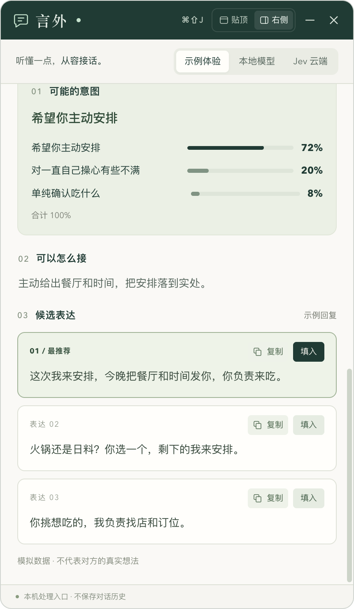
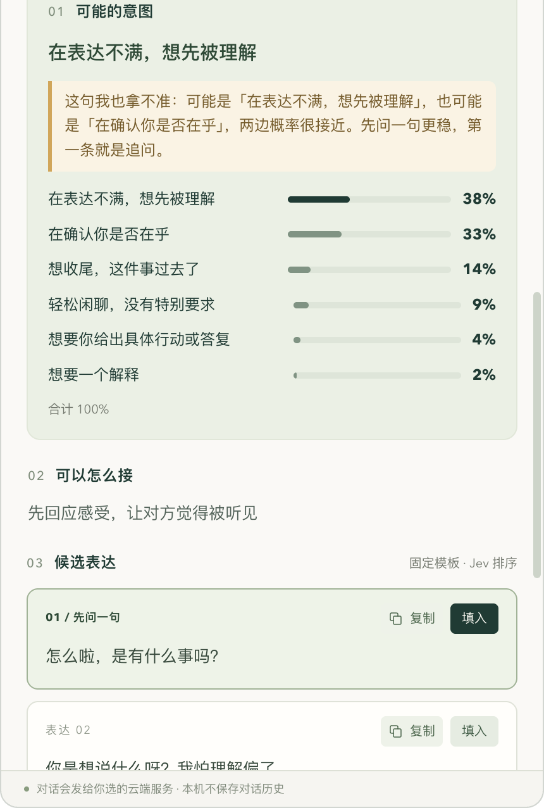
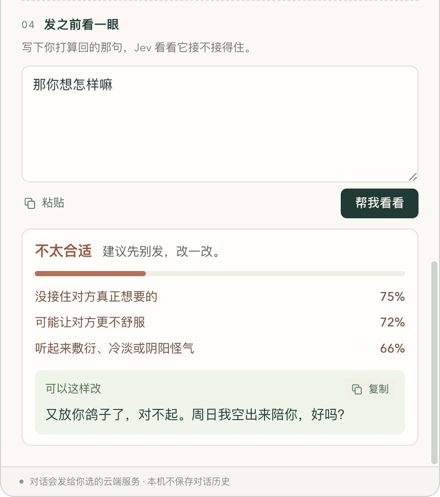
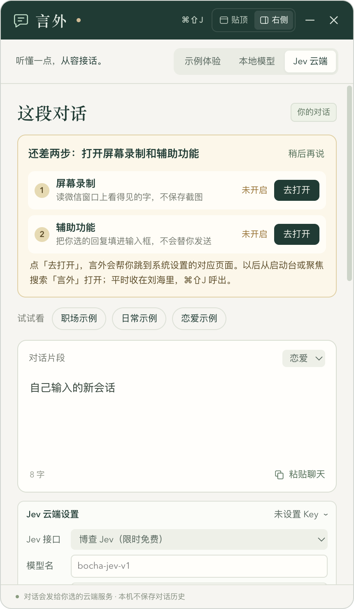

<p align="center">
  
</p>

<h1 align="center">言外 Mac</h1>

<p align="center">
  <b>聊天时帮你听懂话里的意思，再给你三条能直接用的回复。</b><br>
  贴在 Mac 刘海或屏幕右侧的小浮窗 · 基于开源项目 <a href="https://github.com/jev-chat/jev-chat-jarvis">Jev 聊天助手</a> 改写
</p>

<p align="center">
  <a href="../../releases/latest">下载</a> ·
  <a href="#快速上手">快速上手</a> ·
  <a href="#和原项目是什么关系">和原项目的关系</a> ·
  <a href="#隐私">隐私</a> ·
  <a href="#已知局限">已知局限</a> ·
  <a href="#开发者">开发者</a>
</p>

<p align="center">
  
  
  
</p>

> **English:** Yanwai Mac is a small macOS notch/side panel that reads a chat (pasted text, a screenshot, or the WeChat window via on-device OCR), asks [Jev](https://typesafe.ai) what the other person most likely means — with a full probability breakdown — and offers three ranked reply candidates. It never sends anything for you. It is a personal fork of [jev-chat/jev-chat-jarvis](https://github.com/jev-chat/jev-chat-jarvis) (MIT), not an official release by its authors. The UI is Chinese-only.

---

## 它能做什么

<table>
<tr>
<td width="50%" valign="top">

</td>
<td width="50%" valign="top">

**看懂意思，带概率**
对方这句话可能是什么意思，每种可能占几成，一眼看完。不是只给一个结论。

**三条候选，标出最推荐**
每条都能「复制」或「填入」输入框。**言外永远不会替你按发送。**

**三种放入对话的方式**
- **手动粘贴**：把聊天贴进来。
- **复制或截图**：用微信自带截图（⌃⌘A）截一张，言外在本机识别文字、分清你和对方，自动分析。
- **跟随微信**：直接读微信窗口上看得见的字，有新消息自动分析。

**平时藏在刘海里**
收起时和刘海融为一体，`⌘⇧J` 呼出；展开可以贴顶，也可以停在屏幕右侧，拖到哪记到哪。

<sub>左图为内置「示例体验」，数据是模拟的。</sub>
</td>
</tr>
</table>

### 两个原项目没有的功能

<table>
<tr>
<td width="50%" valign="top">

<p><b>拿不准就说拿不准</b><br>
对方只回一个「哦」，谁也说不准是生气还是没事。最可能的意思不到五成，或者前两名差得不多时，言外会直说「这句我也拿不准」，把第一条回复换成一句自然的追问，而不是硬猜。</p>
</td>
<td width="50%" valign="top">

<p><b>发之前看一眼</b><br>
自己想好了怎么回？写下来让 Jev 先看一眼：合不合适、会不会让对方更不舒服、有没有接住对方真正想要的、是不是承诺过头或听着敷衍。分数不高时，给你一版改法（只能复制，不会自动填入）。</p>
</td>
</tr>
</table>

<sub>上面两张是界面示意：界面和判断逻辑是真的，但接口返回的数据是模拟的，不是 Jev 的真实输出。</sub>

## 和原项目是什么关系

言外**不是原创**，是在 [Jev 聊天助手](https://github.com/jev-chat/jev-chat-jarvis)（原仓库 `Finderchangchang/jev-chat-JARVIS`，MIT）的基础上改写的个人 Mac 版本，**不是原作者团队出品**，也没有得到 TypeSafe、博查的背书。刘海浮窗参考了 [TO-DO-Panel](https://github.com/xiaopu-ai/TO-DO-Panel)（MIT）。

原作者团队自己也有 Mac 版 [jev-chat-jarvis-mac](https://github.com/jev-chat/jev-chat-jarvis-mac)，**功能比言外多**（更细的意图分类、风险分级、更多话术、支持 QQ、本地模型等，以它的仓库为准）。如果你想要功能最全的版本，请先看它。

言外换了一些做法：

| | 原作者团队 Mac 版 | 言外 Mac |
|---|---|---|
| 谁做的 | Jev 聊天助手原作者团队 | 个人改写，非官方 |
| 判断方式 | 见原仓库 | **Jev 云端**：Jev 判断意图和动作 → 可选的回复模型写三条候选 → Jev 再排序 |
| 意图拿不准时 | — | **直说拿不准**，第一条改成追问 |
| 检查你自己写的回复 | — | **发之前看一眼**：打分、标风险、给改法 |
| 界面 | 见原仓库 | **刘海浮窗**，可贴顶或停在右侧 |
| 系统权限 | 见原仓库 | **权限引导卡片**，缺哪个带你去开 |
| 放入对话 | 读微信窗口 | **手动粘贴 / 复制或截图 / 跟随微信** 三选一 |
| 自动发送 | 不发送 | 不发送，只填入或复制 |

> 关于安卓：原项目的安卓端从 v1.4 起已停止支持微信（微信新版隐藏了无障碍文字，部分设备还开了防截屏），并有用户反馈用过后微信截屏被禁。言外只发布 Mac 版。

## 快速上手

### 1. 下载安装

1. 到 [Releases](../../releases/latest) 下载 `言外-0.3.1-mac-arm64.zip`，双击解压，把 **言外.app** 拖进「应用程序」。
2. **第一次打开会被 macOS 拦下来**。言外没有经过 Apple 公证（公证需要付费的开发者账号），这是正常现象。放行方法任选一种：
   - 打开「系统设置 → 隐私与安全性」，拉到最下面，在「已阻止打开言外」旁边点 **仍要打开**，输入密码确认。
   - 或者在「终端」里执行一次：
     ```sh
     xattr -dr com.apple.quarantine /Applications/言外.app
     ```
3. 之后从启动台或聚焦搜索「言外」打开。它不在程序坞里，而是住在菜单栏和刘海里；`⌘⇧J` 随时呼出。

> 需要 **Apple 芯片（M 系列）的 Mac、macOS 13 或更新版本**。Intel Mac 暂不支持。

### 2. 开两项权限（按需）

第一次打开，言外会显示一张引导卡片。点「去打开」，它会跳到系统设置里对应的位置，你只需要把「言外」的开关打开：



| 权限 | 用来做什么 | 不开会怎样 |
|---|---|---|
| **屏幕录制** | 「跟随微信」：读微信窗口上看得见的字 | 用不了「跟随微信」，另外两种方式照常用 |
| **辅助功能** | 「填入」：把你选的回复放进输入框 | 点「填入」会改成复制，你自己粘贴 |

- 开完屏幕录制，点卡片上的「重启言外」才会生效。
- 关掉卡片后，想再打开：点菜单栏里的言外图标 →「权限设置…」。
- 言外不会自己去开权限，每一项都由你手动确认。

<br clear="right">

### 3. 设置 Jev（分析自己的聊天需要）

「示例体验」不需要任何设置，可以先点「职场 / 日常 / 恋爱示例」看看效果。要分析你自己的聊天，切到 **Jev 云端**，在「Jev 云端设置」里选一个接口、填 Key：

| Jev 接口 | 去哪拿 Key | 说明 |
|---|---|---|
| **博查 Jev** | [open.bocha.cn](https://open.bocha.cn) | 目前限时免费。⚠️ 言外还没用真实博查 Key 测过，协议与 TypeSafe 相同 |
| **TypeSafe 官方** | [console.typesafe.ai](https://console.typesafe.ai) | Jev 的官方接口 |
| **OpenRouter** | [openrouter.ai](https://openrouter.ai) | 需要先充值；已实测跑通 |

**回复模型**是可选的：
- 不配：三条候选用内置的固定模板，同样由 Jev 排序。
- 配 DeepSeek / OpenRouter / 任意 OpenAI 兼容接口：由模型写三条更贴合对话的回复，再交给 Jev 排序。Jev 和回复模型都选 OpenRouter 时，可以共用一把 Key。

填好点「测试连接」，通过就可以用了。

### 4. 日常怎么用

1. 在「对话来源」里选一种放入方式：
   - **跟随微信**：大部分时候能直接读到微信窗口，有新消息会自动分析。
   - **复制或截图**：如果「跟随微信」读不到（微信偶尔会给窗口开防截屏，言外会提示你），就用微信自带截图 `⌃⌘A` 截一张聊天，点完成，言外自动接上。
   - **手动粘贴**：把聊天内容贴进输入框，点「分析这段」。
2. 看意图和概率，从三条候选里挑一条：「复制」或「填入」，**发送由你自己按**。
3. 想自己回？写在「发之前看一眼」里，点「帮我看看」。

## 隐私

- **Key 存在钥匙串里**：用 macOS 钥匙串加密保存在本机，界面只知道「有没有存」，拿不到明文。
- **不存聊天记录**：对话只在内存里，退出就没了。截图在本机识别文字后直接丢弃，不落盘。
- **只填不发**：「填入」只往输入框里追加文字，不按回车，不模拟点击发送。搜索框、密码框等一律退回复制。
- **只读微信窗口**：「跟随微信」只读应用名为「微信 / WeChat / Weixin」的那一个窗口，不截全屏、不录音，也不读其他应用的内容。
- **选了云端才上传**：只有你选「Jev 云端」并填了 Key，对话才会发给你选的 Jev 接口和回复模型服务商；界面底部会一直提示。选「示例体验」「本地模型」时不连任何云端服务，也不会偷偷用云端兜底。
- **不绕过防截屏**：微信开了防截屏时，言外只提示你改用微信自带截图，不会尝试绕过。

## 已知局限

说实话，下面这些还没在真实环境里测通，或者本身就有限制：

| 项目 | 状态 |
|---|---|
| 跟随微信 | ✅ 真实微信实测通过：能读到聊天，「对方 / 我」分得对，Jev 云端正常出结果。但微信的防截屏是**间歇性**的，读不到时截一张图也行 |
| 复制或截图 | ⚠️ 用合成截图和剪贴板图片测过，**还没用真实微信截图测过** |
| 填入 | ⚠️ **还没在真实微信输入框里测过**。新版微信的输入框可能不暴露给辅助功能（原团队 Mac 版有类似反馈），这种情况下会退回复制 |
| 博查 Jev | ⚠️ 没有真实 Key，未实测 |
| 本地模型 | 🧪 实验性，**没有用真实模型权重验收**，见 [`local-model/`](local-model/) |
| 识别准确度 | OCR 有客观边界：长气泡、群昵称、图片表情、侧栏宽度变化都可能漏识别；看不见的消息不会去猜 |
| 平台 | 只支持 Apple 芯片 + macOS 13+；没有 Apple 公证 |

Jev 给出的是概率判断，不代表对方的真实想法。人和人之间的事，最后还是你自己拿主意。

---

## 开发者

### 环境

- Apple Silicon Mac，macOS 13+（14+ 用 `SCScreenshotManager`，13 用单窗口 `SCStream` 取一帧）
- Node 22.12+、Xcode Command Line Tools
- Electron 固定为 44.0.0（`package-lock.json` 锁定）

### 构建与测试

```sh
npm install
npm run build:native   # 编译 notch-metrics / watch-chat / fill-text 三个 Swift 小工具
npm test               # Node 单元测试
npm run test:native    # 原生工具自检：合成聊天图 OCR、深浅色截图分人、填入规则
npm run smoke          # Electron 界面冒烟：只用模拟数据和隔离配置
npm start              # 开发模式运行
```

- `test:native` 只用 `tests/fixtures/` 里的合成图片，不截取任何真实应用，不需要屏幕录制权限。合成图由 `tests/make-fixture.swift`、`tests/make-crop-fixture.swift` 生成。
- `smoke` 不启动 OCR 和前台观察进程，不读真实剪贴板，不连云端，不写入其他应用。截图输出到 `YANWAI_SMOKE_DIR`（默认 `smoke-output/`）。它能验证界面和隔离逻辑，**不能证明**真实微信读取或填入可用。
- 原生工具也可以单独跑：

  ```sh
  native/watch-chat --self-test-layout
  native/watch-chat --self-test tests/fixtures/chat-bubbles.png
  native/fill-text --self-test
  native/fill-text --dry-run '合成候选文本，不写入'
  ```

### 打包

```sh
YANWAI_SIGN_IDENTITY="Apple Development: 你的名字 (XXXXXXXXXX)" npm run pack
```

生成 `dist/言外.app`（已有旧包会挪到 `dist/旧版/`）。用固定证书签名，重新打包后 macOS 仍认得是同一个 App，已开的权限不会失效；不传 `YANWAI_SIGN_IDENTITY` 就是临时签名，每次打包都要重新授权。

> 做权限相关测试时请用打包好的 `言外.app`，不要用 `npm start`：开完屏幕录制后 macOS 的「退出并重新打开」会拉起一个空壳 Electron。

### 项目结构

```
main.js              主进程：窗口、IPC、对话来源、权限、冒烟测试
jev-cloud.js         Jev 云端：判断 → 生成候选 → 排序；发之前看一眼
cloud-settings.js    Key 加密存储（safeStorage），界面只拿到「是否已保存」
input-sources.js     三种对话来源的切换与会话版本
panel-policy.js      浮窗几何、请求闸门、示例数据
fill-policy.js       填入 / 复制兜底规则
renderer/            界面（原生 HTML/CSS/JS，无框架）
native/              Swift：刘海尺寸、微信窗口 OCR 与剪贴板截图、辅助功能填入
local-model/         实验性：Laya 本机服务（未验收）
vendor/to-do-panel/  上游 TO-DO-Panel 几何策略参考与原许可
tests/               单元测试、原生自检、合成测试图
```

### 设计上的几条红线

- 永远不自动发送消息、不模拟回车、不执行交易。
- 密钥不进代码、日志、测试输出和 Git。
- 示例数据必须明确标成模拟，且不调用任何模型。
- 用户没选「Jev 云端」时，绝不偷偷走云端。
- 检测到防截屏只提示，不绕过。
- 修改 `jev-cloud.js` 中移植自上游的问题措辞时，保留出处注释。

欢迎提 Issue 和 PR。

## 许可与致谢

[MIT](LICENSE)。保留上游版权：`Copyright (c) 2026 Jev 聊天助手 contributors`；言外的改动：`Copyright (c) 2026 泽轩604`。

- [Jev 聊天助手](https://github.com/jev-chat/jev-chat-jarvis)（MIT）：产品思路与 Jev 判断问题的措辞
- [jev-chat-jarvis-mac](https://github.com/jev-chat/jev-chat-jarvis-mac)：按窗口读取微信的思路（代码另写）
- [TO-DO-Panel](https://github.com/xiaopu-ai/TO-DO-Panel)（MIT）：刘海浮窗与多屏定位
- [Jev](https://typesafe.ai)（TypeSafe）：意图判断与排序
- [Electron](https://www.electronjs.org/)、Apple Vision / ScreenCaptureKit

详见 [THIRD_PARTY_NOTICES.md](THIRD_PARTY_NOTICES.md)。
